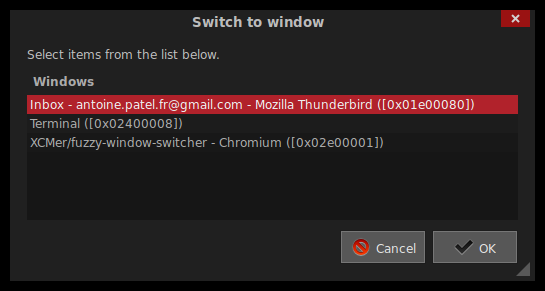

# xwindow-switcher.sh

A minimalist (<20 LOC) x11 window switcher (ALT+TAB replacement) in BASH.

Powered by [wmctrl](https://sites.google.com/site/tstyblo/wmctrl/) and
[Zenity](https://wiki.gnome.org/Projects/Zenity).

License: [MIT](LICENSE)



*Note*: I use a dark GTK 3.x theme, as shown by the screenshot. The
 colors of `xwindow-switcher.sh` will match your GTK theme, just like
 any other GTK application you have.

To switch to a window using only your keyboard (no mouse), just type
the first letters of the window's title you want to switch to; you'll
see it automatically selected. Then hit your `enter` key.

## Installation

1. Make sure you have
[wmctrl](https://sites.google.com/site/tstyblo/wmctrl/) and
[Zenity](https://wiki.gnome.org/Projects/Zenity) installed first (Use
your package manager if not).

2. Run [xwindow-switcher.sh](xwindow-switcher.sh) in a terminal
   (`./xwindow-switcher.sh`).

## Usage

###### `xwindow-switcher.sh`

Can be called without any options (defaults to a 600*400 GUI).

###### `xwindow-switcher.sh --help`

Shows the relevant parts of the help of Zenity. `xwindow-switcher.sh`
accepts the same arguments as `zenity --list ...`.

###### `xwindow-switcher.sh --width=800 --height=600 --title="My Custom Title"`

Sets the width, height and title of `xwindow-switcher.sh`'s GUI.

## Status

Production/Stable

All major features are here. No new features planned. Will work as
long as wmctrl and Zenity do.

## Why ?

```
~/bin/xwindow-switcher $ cloc .
       3 text files.
       3 unique files.                              
     153 files ignored.

http://cloc.sourceforge.net v 1.60  T=0.33 s (3.0 files/s, 210.8 lines/s)
-------------------------------------------------------------------------------
Language                     files          blank        comment           code
-------------------------------------------------------------------------------
Bourne Shell                     1             10             42             18
-------------------------------------------------------------------------------
```
